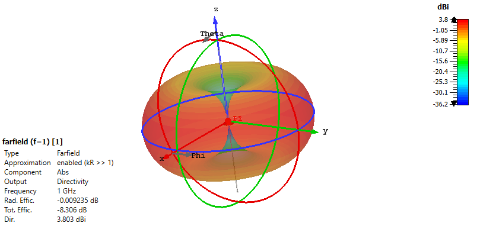
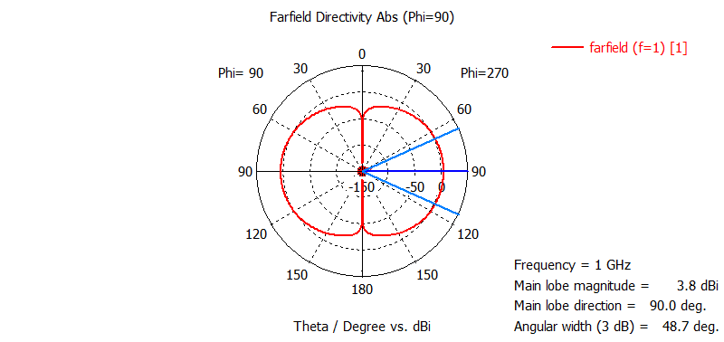
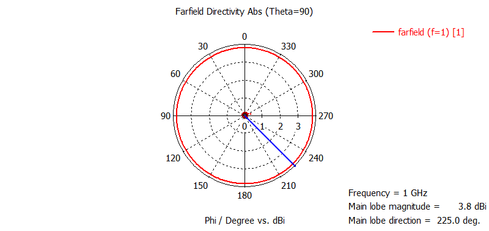

## 1. Antena Dipolo de Media Onda (λ/2)

**Configuración de simulación:** Dipolo delgado resonante, orientado a lo largo del eje Z, alimentado en su centro mediante un puerto discreto.

### 1.1 Diagrama de Radiación 3D y Patrones Fundamentales

<!-- Imagen 1: Diagrama 3D -->

*Figura 1.1: Patrón de radiación tridimensional característico de un dipolo de media onda. Se observa la forma toroidal (en "donut") con nulos de radiación en la dirección del eje del dipolo (Z) y máximo en el plano ecuatorial (XY).*

<!-- Tabla para Patrones E y H -->
<table>
<tr>
<!-- Celda para el Patrón E -->
<td width="50%">

<em>Figura 1.2: Corte en el Plano E ($\phi = 0 = 90°$)</em>

</td>
<!-- Celda para el Patrón H -->
<td width="50%">

<em>Figura 1.3: Corte en el Plano H ($\theta = 90°$)</em>

</td>
</tr>
</table>

*Análisis:* El patrón en el **Plano E** (que contiene al dipolo) muestra el clásico diagrama de dos lóbulos, mientras que el **Plano H** (perpendicular al dipolo) confirma la radiación omnidireccional esperada. Estos cortes validan la correcta simulación de los campos fundamentales.

### 1.2 Parámetros de Impedancia y Ancho de Banda

<!-- Imagen 2: Parámetro S11 del dipolo base -->

*Figura 1.4: Magnitud del parámetro S11 (en dB) para el dipolo delgado sintonizado. La frecuencia de resonancia (mínimo de S11) se encuentra en [INSERTAR FRECUENCIA] GHz, con un valor de [INSERTAR VALOR S11] dB, lo que indica una buena adaptación a la impedancia de referencia de 50 Ω.*

### 1.3 Análisis de Ancho de Banda vs. Relación Longitud/Diámetro (L/D)

**Objetivo:** Evaluar el efecto del grosor del dipolo (simulado mediante la relación longitud/diámetro, L/D) en su ancho de banda de impedancia.

<!-- Imagen 3: S11 comparativo para diferentes L/D -->

*Figura 1.5: Superposición de las curvas S11 para dipolos con relaciones L/D de 1000 (muy delgado), 50 y 25. Se observa claramente cómo al aumentar el grosor (disminuir L/D) el ancho de banda se incrementa, a costa de un ligero desplazamiento en la frecuencia de resonancia.*

**Resultados Cuantitativos del Ancho de Banda (BW @ S11 < -10 dB):**
*   **L/D = 1000 (Dipolo delgado):** `[INSERTAR ANCHO DE BANDA] MHz`
*   **L/D = 50:** `[INSERTAR ANCHO DE BANDA] MHz`
*   **L/D = 25 (Dipolo grueso):** `[INSERTAR ANCHO DE BANDA] MHz`

**Conclusión del análisis:** La simulación confirma el principio teórico de que **dipolos más gruesos (menor relación L/D) presentan un mayor ancho de banda de impedancia**. Este es un compromiso clásico (trade-off) en el diseño de antenas entre la geometría ideal y el desempeño en frecuencia.

---